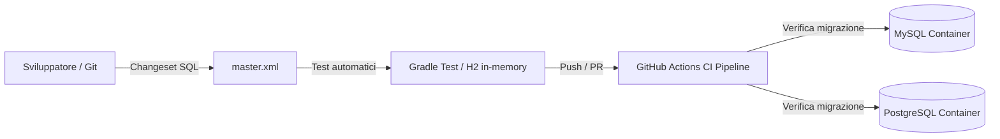
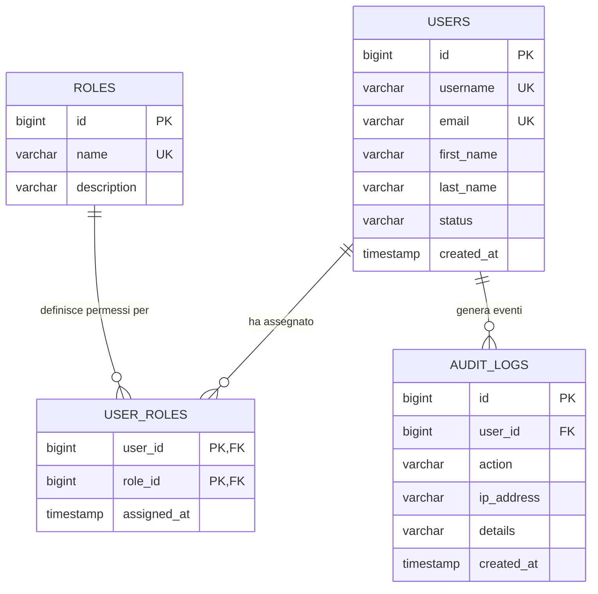

# Database Continuous Integration & Automated Migration

[](https://github.com/stefanoauciello/db-continuos-integration/actions/workflows/ci.yml)
[](https://openjdk.org/)
[](https://gradle.org/)
[](https://www.liquibase.org/)
[](https://www.mysql.com/)
[](https://www.postgresql.org/)

Un'architettura di riferimento e template pratico per implementare la **Continuous Integration (CI) e il versionamento automatico dello schema del database** utilizzando **Liquibase**, **Gradle**, **Docker** e **GitHub Actions**.

---

## 🎯 Obiettivo del Progetto

Nei moderni team di sviluppo software, la gestione dello schema del database rappresenta spesso un collo di bottiglia critico:
- **Schema Drift**: disallineamenti incontrollati tra i database di sviluppo locale, gli ambienti di collaudo (staging/test) e la produzione.
- **Errori Umani**: script SQL manuali eseguiti senza tracciabilità, senza controllo di versione e privi di procedure di rollback verificate.
- **Mancanza di Automazione CI/CD**: pipeline di rilascio applicativo che falliscono perché le migrazioni del database non vengono testate preventivamente.

Questo progetto risolve tali problemi proponendo un workflow completo di **Database as Code**:
1. **Modifiche tracciate e versionate**: ogni modifica DDL e DML è espressa tramite *changeset* SQL standardizzati e versionati su Git.
2. **Idempotenza e sicurezza**: Liquibase tiene traccia dei changeset già applicati tramite la tabella `DATABASECHANGELOG`, impedendo riesecuzioni accidentali.
3. **Rollback deterministico**: ogni changeset include la relativa istruzione di rollback per consentire l'annullamento rapido e controllato.
4. **Test automatici a zero configurazione**: la suite di test integrata valida le migrazioni in memoria (su H2) in frazioni di secondo senza richiedere l'installazione di alcun database esterno.
5. **Verifica multi-database e CI**: supporto immediato a **MySQL** e **PostgreSQL**, verificato automaticamente tramite pipeline GitHub Actions su veri container di servizio.

---

## 🏗️ Architettura e Flusso Operativo



1. Lo sviluppatore definisce una nuova evoluzione dello schema in un file SQL formattato con autore, ID e blocco `--rollback`.
2. Il file `master.xml` aggrega in ordine cronologico i changelog del progetto.
3. Lo sviluppatore o la pipeline esegue `./gradlew test`: la suite JUnit 5 avvia un database isolato in memoria ed esegue migrazione, verifiche di integrità e rollback.
4. Al commit/push su GitHub, la pipeline automatica avvia container reali MySQL e PostgreSQL, applica i changeset, ne verifica il rollback e riallinea lo schema.

---

## 📁 Struttura del Repository

```
db-continuos-integration/
├── .github/
│   └── workflows/
│       └── ci.yml                 # Pipeline GitHub Actions (MySQL, Postgres, Test)
├── db/
│   ├── src/
│   │   ├── main/
│   │   │   └── resources/
│   │   │       ├── dbschema/      # Script SQL versionati con standard Liquibase
│   │   │       │   ├── 001-create-users-table.sql     # Tabella utenti e vincoli
│   │   │       │   ├── 002-create-roles-table.sql     # Tabella ruoli e relazione user_roles
│   │   │       │   ├── 003-seed-reference-data.sql    # Dati di bootstrap (ruoli, pionieri tech)
│   │   │       │   └── 004-create-audit-logs-table.sql# Tabella audit log con indici e FK
│   │   │       └── liquibase/
│   │   │           └── master.xml # ChangeLog master che include le migrazioni
│   │   └── test/
│   │       └── java/
│   │           └── com/github/auciellos/db/
│   │               └── LiquibaseMigrationTest.java # Test JUnit 5 di migrazione e rollback
│   └── build.gradle               # Configurazione Gradle del modulo Liquibase (attività H2, MySQL, Postgres)
├── gradle/
│   └── wrapper/                   # File del Gradle Wrapper (JAR e proprietà)
├── build.gradle                   # Root build script aggregatore
├── docker-compose.yml             # Servizi locali MySQL 8 e PostgreSQL 16
├── gradlew                        # Script wrapper Unix/macOS
├── gradlew.bat                    # Script wrapper Windows
├── settings.gradle                # Definizione dei moduli del progetto Gradle
└── README.md                      # Documentazione del progetto
```

---

## 🗄️ Modello Dati e Diagramma ER

Il database implementa un modello pulito e realistico per la gestione di utenti, ruoli con permessi e audit trail di sicurezza:



---

## 📋 Changeset Inclusi nel Progetto

Il progetto contiene 4 migrazioni dimostrative progressive, scritte in formato **Liquibase Formatted SQL** ad alta leggibilità e conformi agli standard enterprise:

| File | Changeset ID | Operazione / Descrizione | Rollback Supportato |
| :--- | :--- | :--- | :--- |
| `001-create-users-table.sql` | `auciellos:001-create-users-table` | Creazione tabella principale `users` con vincoli di univocità (`username`, `email`) e timestamp | `DROP TABLE users;` |
| `002-create-roles-table.sql` | `auciellos:002-create-roles-and-permissions` | Creazione tabella ruoli `roles` e tabella ponte Many-to-Many `user_roles` con vincoli di chiave esterna (`ON DELETE CASCADE`) | `DROP TABLE user_roles;`<br/>`DROP TABLE roles;` |
| `003-seed-reference-data.sql` | `auciellos:003-seed-reference-data` | Popolamento ruoli di sistema (`ROLE_ADMIN`, `ROLE_DEVELOPER`, `ROLE_USER`), utenti di test e associazioni | Pulizia deterministica inversa (`DELETE FROM ... WHERE ...`) |
| `004-create-audit-logs-table.sql` | `auciellos:004-create-audit-logs-table` | Creazione tabella `audit_logs` per tracciamento eventi di sicurezza con indice dedicato `idx_audit_logs_user_id` e FK con `ON DELETE SET NULL` | `DROP TABLE audit_logs;` |

---

## 🚀 Guida Rapida (Quick Start)

### Prerequisiti
- **Java JDK 21** o superiore
- **Gradle 8+** (oppure utilizzare il **Gradle Wrapper** `./gradlew` o `gradlew.bat` già incluso)
- *(Opzionale)* **Docker & Docker Compose** per testare su istanze reali di MySQL/PostgreSQL

### 1. Test Immediato (Senza dipendenze esterne)
Clona il repository ed esegui la suite di test:

```bash
git clone https://github.com/stefanoauciello/db-continuos-integration.git
cd db-continuos-integration
./gradlew test
```

Su Windows:
```cmd
gradlew.bat test
```

Il test JUnit `LiquibaseMigrationTest`:
- Avvia un database in-memory H2 compatibile e isolato per ogni test.
- Esegue la migrazione di tutti i changelog SQL applicando vincoli, indici e dati di seed.
- Valida l'integrità referenziale, le relazioni Many-to-Many e i dati anagrafici tramite query SQL native e asserzioni AssertJ.
- Esegue il rollback mirato del changeset 4 (`audit_logs`) e verifica che le tabelle precedenti (`users`, `roles`) rimangano integre.
- Verifica il corretto funzionamento dell'eliminazione a cascata (`ON DELETE CASCADE`) sulla tabella ponte.
- Riapplica l'aggiornamento confermando l'idempotenza e la robustezza dello schema.

---

## 🐳 Esecuzione su Database Reali con Docker

Per verificare le migrazioni su veri motori di database (MySQL e PostgreSQL):

### 1. Avviare i database locali
Dalla radice del progetto, avvia i container tramite Docker Compose:

```bash
docker compose up -d
```

Questo comando avvia:
- **MySQL 8.0** sulla porta `3306` (database: `db_ci`, user: `root`, password: `root`)
- **PostgreSQL 16** sulla porta `5432` (database: `db_ci`, user: `postgres`, password: `postgres`)

### 2. Eseguire la migrazione su MySQL

```bash
./gradlew update -Pmysql
```

Per testare il rollback dell'ultimo changeset:
```bash
./gradlew rollbackCount -Pmysql -ProllbackCount=1
```

Per riallineare lo schema:
```bash
./gradlew update -Pmysql
```

### 3. Eseguire la migrazione su PostgreSQL

```bash
./gradlew update -Ppostgres
```

Per testare il rollback su PostgreSQL:
```bash
./gradlew rollbackCount -Ppostgres -ProllbackCount=1
```

### 4. Parametri Personalizzati
È possibile sovrascrivere host, porta, database e credenziali direttamente da riga di comando:

```bash
./gradlew update -Pmysql \
    -PmysqlHost=192.168.1.100 \
    -PmysqlPort=3306 \
    -PmysqlDb=production_db \
    -PmysqlLogin=admin \
    -PmysqlPassword=secret_password
```

### 5. Fermare i container Docker

```bash
docker compose down
```

---

## ⚙️ Pipeline di Continuous Integration (GitHub Actions)

Il progetto include un workflow di CI completo definito in [`.github/workflows/ci.yml`](.github/workflows/ci.yml).

Ad ogni `push` o `pull_request` sui branch `main` e `master`:
1. Viene predisposto l'ambiente **Java 21 Temurin** con cache Gradle.
2. Vengono avviati come service container ufficiali **MySQL 8** e **PostgreSQL 16**.
3. Viene eseguita la suite di test unitari e di migrazione in memoria (`./gradlew clean test`).
4. Viene eseguito il ciclo completo di migrazione, rollback e ri-migrazione sia su **MySQL** sia su **PostgreSQL**.

Questo garantisce che nessun commit possa compromettere la compatibilità dello schema o rompere le migrazioni.

---

## 💡 Best Practice Liquibase Adottate

- **Formatted SQL**: utilizzo di standard SQL nativo arricchito con direttive Liquibase per garantire massima leggibilità a DBA e sviluppatori.
- **Rollback Obbligatorio**: ogni changeset DDL o DML è accompagnato dalla strategia di ripristino corrispondente.
- **Separazione di Ambiente**: configurazione modulare gestita tramite attività Gradle dedicate (`h2`, `mysql`, `postgres`).
- **Nessuna dipendenza locale hardcoded**: assenza di percorsi assoluti; le risorse risiedono in `src/main/resources` e sono accessibili tramite classpath.
